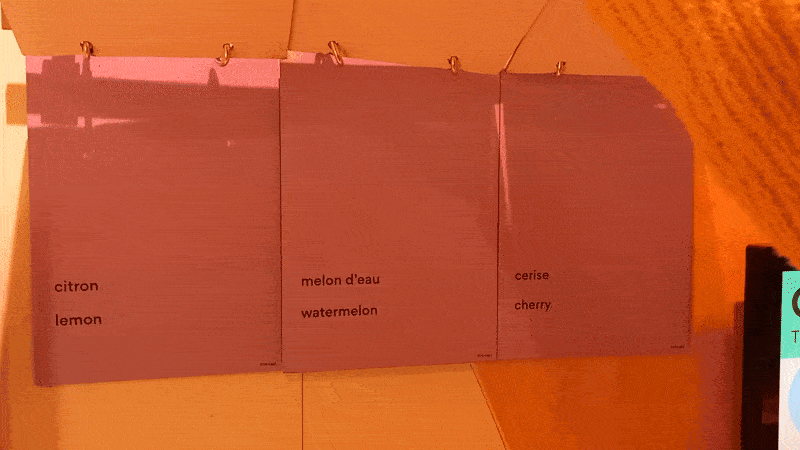

# Banquet - Centre des sciences de Montréal

Centre des sciences de Montréal *sourse d'image par [Centre des sciences](https://www.centredessciencesdemontreal.com/information-visiteurs)*

Le **31 janvier,** ma groupe de d’œuvres et de dispositifs multimédias et moi avons fait une visite dans le **Centre des sciences de Montréal** pour une exposition intéractive intérieure temporaire (16 mai 2024 - 16 mars 2025) **"Banquet"**. Principalement, cet exposition est orienté vers des enfants, mais nous avons fait la visite pour notre cours de collège.
## Goûter la couleur

L'œuvre que j'ai aimé le plus- "Goûter la couleur" ou "Goût du rose". Ce dispositif a été crée par **"Universcience"**- centre de sciences à Paris, en 2021 *(plus des détails sur l'image)*.

L'idée principale de cette *installation intéractive* est que depuis notre enfance nous associons la couleur et le goût, par exemple, rouge- cerise, jaune- citron, etc. Alors le but de cet experience- se tester et voir si on est capables de distinguer les goûts sans être influencé par la couleur.

Le principe de fonctionnement de ce dispositif est assez facile: le visiteur prends un sachet des bonbons dans la boîte distributive à l'entré de dispositif et marche vers les ecrans à côté, qui sont brancés en arrière du mur. Tout les ingrédients sont écrits sur les papiers à côté de la boîte. Après il/elle touche sur les boutons sur l'ecran et suive les instructions, qui sont assez faciles à comprendre pour un enfant.

Quand tu ouvre le sachet tu le met dans la poubelle qui est à côté de l'ecran.

Après avoir goûté le bonbon tu dois deviner son saveur et peser sur les boutons de l'ecran.

Finallement, il s'affichera la bonne réponse et les statistiques de ce que les autres utilisateurs ont deviné.

De plus, à côté des ecrans il y a des images avec les réponses corréctes.

Pour que ça soit plus clair pour vous, j'ai enregistré [mon petit blog sur YouTube.](https://youtu.be/HBgw46AmXJ8)  

## Ce que j'ai aimé le plus:
Selon moi, c'estait un des experiences les plus intéressants et intéractifs sur cette exposition. La mise en scene et aussi facile à reproduir: juste des ecrans, un table, des poubelles, une boîte

**Reférénces et géneriques**  

https://www.centredessciencesdemontreal.com/ 
https://www.universcience.fr/fr/accueil
