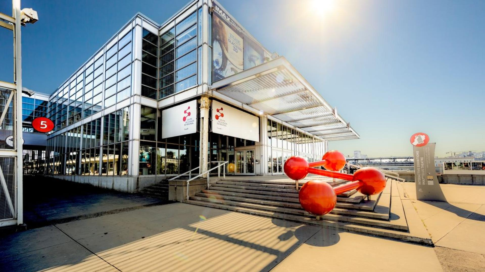
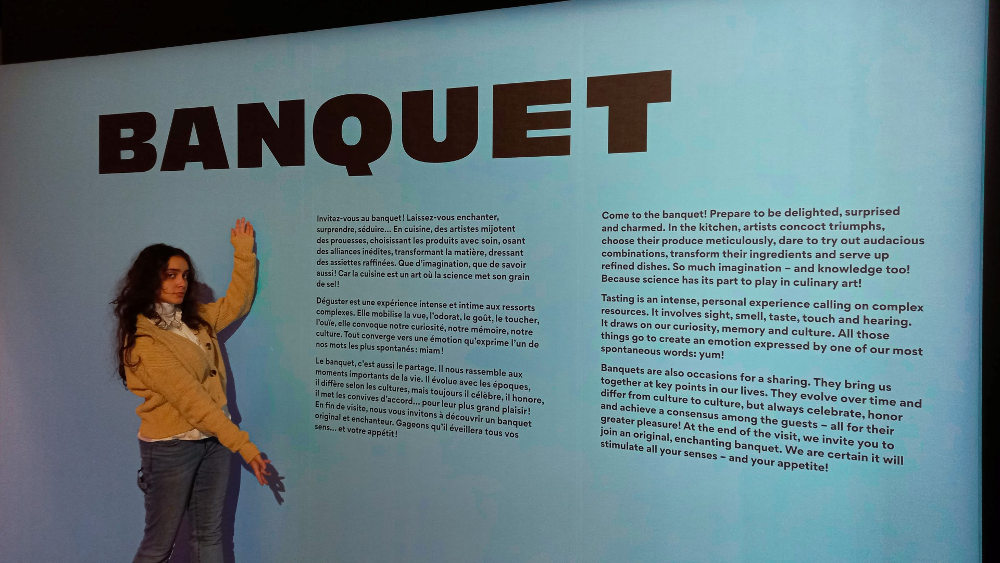

# Banquet - Centre des sciences de Montréal

Centre des sciences de Montréal *sourse d'image par [Centre des sciences](https://www.centredessciencesdemontreal.com/information-visiteurs)*

Le **31 janvier,** ma groupe de d’œuvres et de dispositifs multimédias et moi avons fait une visite dans le **Centre des sciences de Montréal** pour une exposition intéractive intérieure temporaire (16 mai 2024 - 16 mars 2025) **"Banquet"**.
# Goûter la couleur

L'œuvre que j'ai aimé le plus- "Goûter la couleur" ou "Goût du rose". Ce dispositif a été crée par **"Univercience"** en 2021 *(plus des détails sur l'image)*.

[Mon petit blog sur YouTube](https://youtu.be/HBgw46AmXJ8)  
**Reférénces**  
https://www.centredessciencesdemontreal.com/ 
https://www.universcience.fr/fr/accueil
