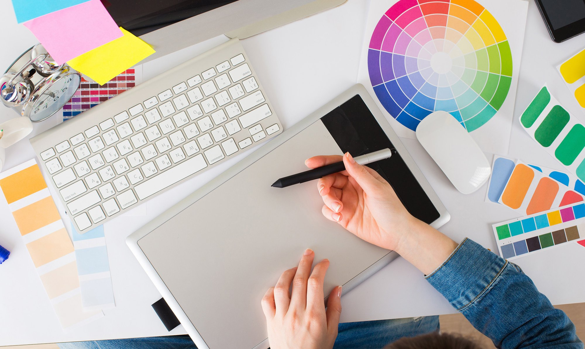

# Iryna Lysenko

Un de mes projets **"Autoportrait"** en *illustration numerique* en 2024.

Mon video préféré sur l'internet: https://youtu.be/dQw4w9WgXcQ?si=_eNsZ1NUsu3Mh3-Q

## **Intérêts dans le multimedia**
La programme de TIM je peux sepsrer en 2 catégories: le coding et le visuel. Moi, je préfére le visuel. 
Je viens d'Ukraine où j'ai étudié à l'école de l'art pendant 6 ans, donc j'aime tous ce qui est avec le dessin et l'art. 
En TIM j'aime le design graphique, illustration, video et animation. 

## **Intérêts dans la vie**

Comme j'ai déjà mentionné, j'aime dessiner. Alors, un de mes intérets personneles c'est **dessinner sur les vêtements.**  
J'ai fait quelques vidéos sur TikTok et Youtube de moi qui dessine sur mes pantalons. 
Voici un exemple: https://youtube.com/shorts/CTJaK512JlI?si=ceLOTWathlMBhGZB 
