<h1 align="center">Ravel Ravel Interval</h1>

  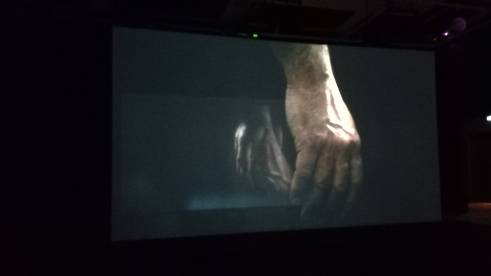
  <em>Photo prise par Iryna Lysenko</em>

  

Le **4 avril dans le Musée des beaux-arts de Montréal,** ma classe d’œuvres et de dispositifs multimédias a visité **une œuvre d'art et une exposition du même nom intérieure immersive temporaire** (jusqu'au 27 avril 2025) **Ravel Ravel Interval** par **Anri Sala**, qui présente **l'instalation vidéo immersive**. Principalement destinée à tous les résidents de Montréal, cette exposition nous a permis de découvrir ce que nous pourrons réaliser dans deux ans dans notre programme.
*Source des informations: [Site web de MBAM](https://www.mbam.qc.ca/fr/expositions/anri-sala/)*

  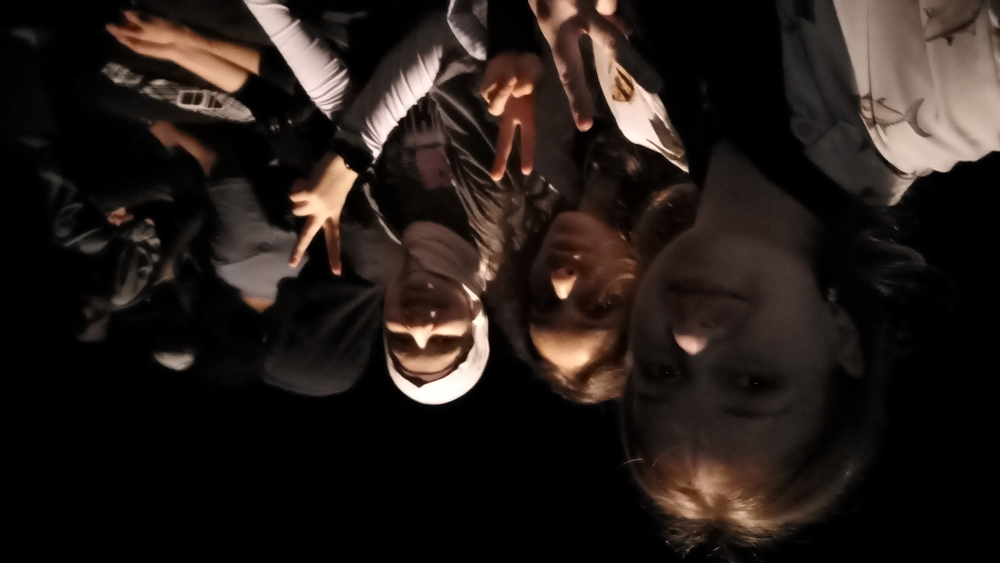

## Description de l'œuvre

<table align="center">
<tr>
<td>
La pièce consiste en une grande salle noire avec deux grands écrans translucides diffusant la vidéo de la performance au piano. Grâce à la taille de la salle, aux écrans et au son, nous pouvons non seulement regarder une vidéo, mais aussi nous immerger complètement dans l'atmosphère.  
  <em>Photo prise par Iryna Lysenko</em>
</td>
<td>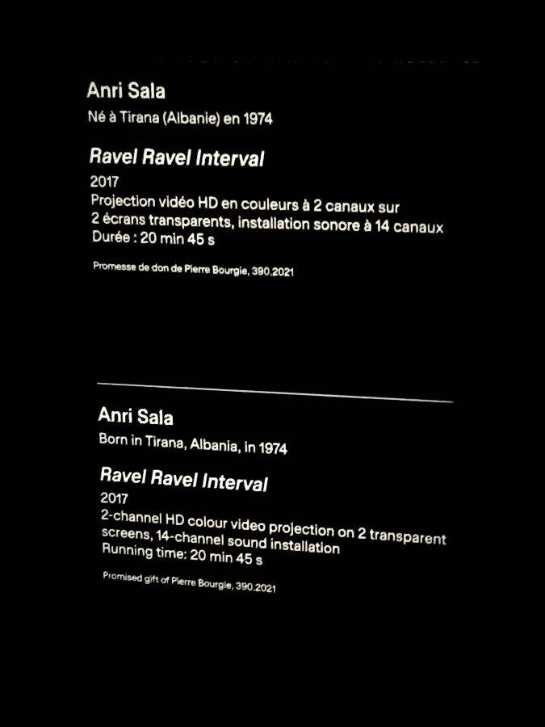</td>
</tr>
</table>
<table align="center">
<tr>
<td>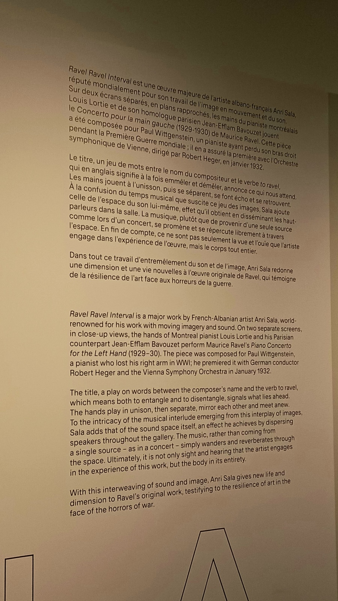</td>
<td>
Dans cette installation marquante, on découvre deux versions presque simultanées du <em>Concerto pour la main gauche en ré majeur</em> de Maurice Ravel (1875-1937). L’œuvre avait été commandée par le pianiste Paul Wittgenstein, qui avait perdu son bras droit pendant la Première Guerre mondiale.

Sala se concentre sur les mains gauches de deux pianistes : Louis Lortie, de Montréal, et Jean-Efflam Bavouzet, de France. Accompagnées d’un orchestre invisible, leurs jeux se répondent et évoluent — parfois parfaitement synchronisés, parfois décalés, ils se croisent, s’éloignent, puis se retrouvent.

Ce léger décalage entre les deux interprétations souligne à quel point chaque geste musical peut traduire une sensibilité unique. Il nous pousse à voir ce flottement non pas comme une erreur, mais comme une partie intégrante — et même précieuse — de notre rapport à l’art… et à nous-mêmes.

*Source des informations: [Site web de MBAM](https://www.mbam.qc.ca/fr/expositions/anri-sala/);*
<em>Photo prise par Iryna Lysenko</em> </td>
</tr>
</table>

### Fonctionnement
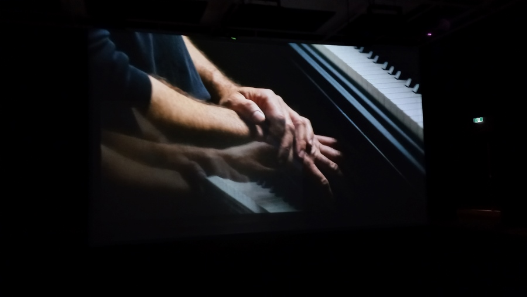

<em>Photo prise par Iryna Lysenko</em>

Ce type d’expérience est assez simple et facile à comprendre. L'utilisateur entre dans la pièce, voit 2 écrans, remarque un banc éclairé et s'assoit dessus en attendant que la vidéo démarre. Au début, il essaie de comprendre pourquoi il y a 2 écrans au lieu d'un, mais au cours du processus, il se rend compte que la séquence vidéo sur les 2 écrans est différente - les mains sont différentes et ne jouent pas en même temps, bien que parfois elles soient similaires, la luminosité augmente et diminue en douceur d'un écran à l'autre, créant un effet unique de superposition d'une vidéo sur une autre. Je n'ai pas d'éducation musicale, donc en tant que spectateur ordinaire, je peux dire que j'ai tellement aimé la qualité de l'acoustique que parfois cela m'a donné la chair de poule.

### Mise en espace

  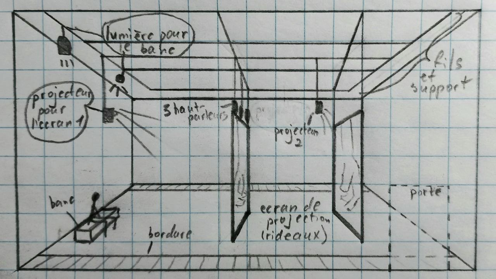

<em>Photo prise par Iryna Lysenko</em>  

Après avoir traversé un petit couloir, nous nous retrouvons dans une immense salle noire avec deux grands écrans transparents. En marchant un peu plus loin à l'intérieur de la pièce le long de la bordure en bois, on peut voir un banc en bois, légèrement éclairé par le haut. La pièce est suffisamment sombre pour que la majorité des utilisateurs ne remarquent pas tous les fils et supports au plafond auxquels sont fixés les écrans, les haut-parleurs, les projecteurs et l’éclairage. De plus, selon notre professeur, les fils vont de haut en bas, soit sous le plafond, soit à l'intérieur des murs. J'aurais aimé les prendre en photo, mais le flash n'était pas autorisé, alors j'ai esquissé mes idées.  

  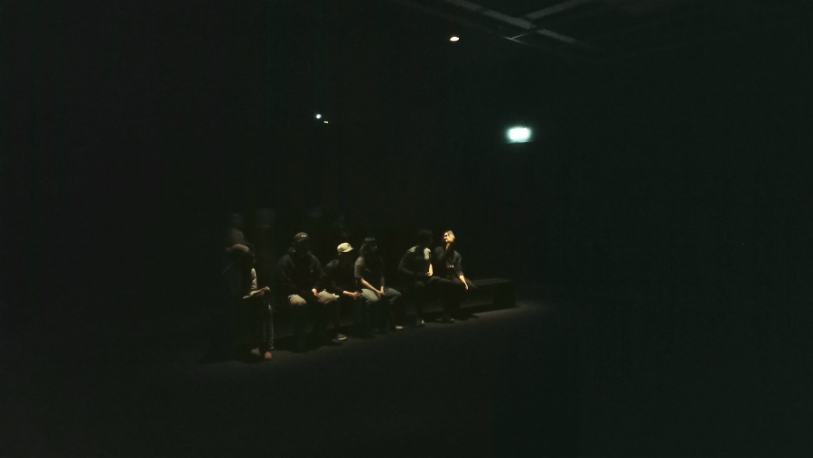 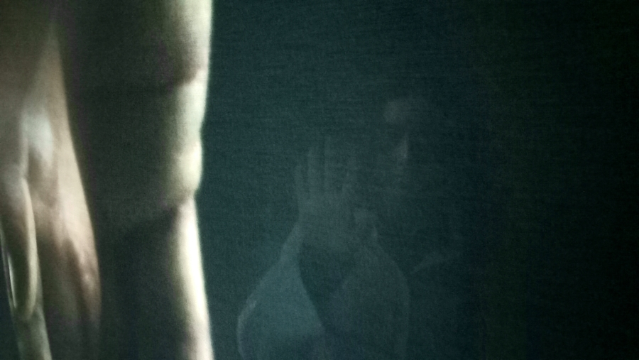
  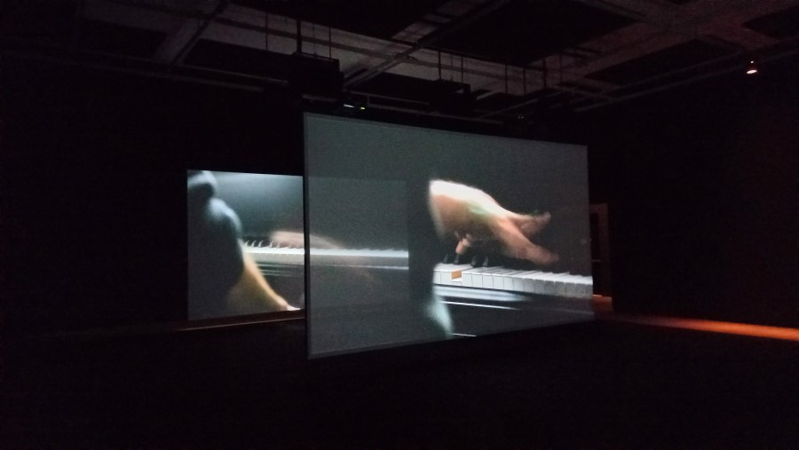 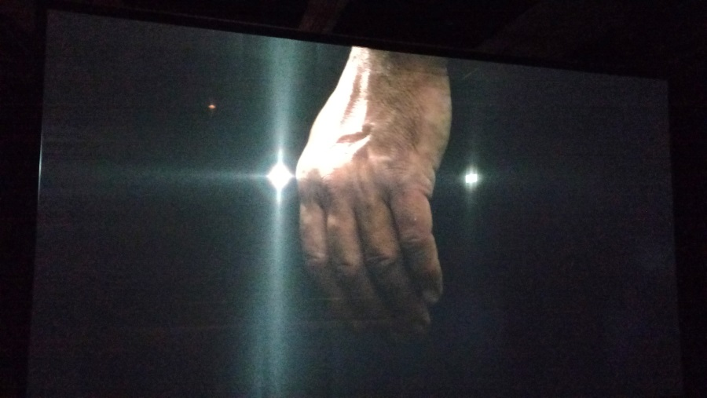
  <em>Photos prises par Iryna Lysenko</em>

  

### Éléments nécessaires à la mise en exposition
- une grande pièce noire
- 2 projecteurs
- 2 ecrans de projection
- beaucoup de fils
- 14 haut-parleurs
- 1 banc
- au moins 2 sources de lumière

## Expérience vécue
Généralement, j’ai beaucoup apprécié mon expérience. Personnellement, j'aime la musique symphonique et j'aime aussi écouter les concerts et malgré que c'était une vidéo, à cause de l'immersion je m'ai sensé comme en concert.

Ce qui a légèrement nui à l’expérience, c’est que ce n'était pas tellement évidant à quel moment la musique commence, car il n'y avait pas de crédits avec le titre de l'œuvre.

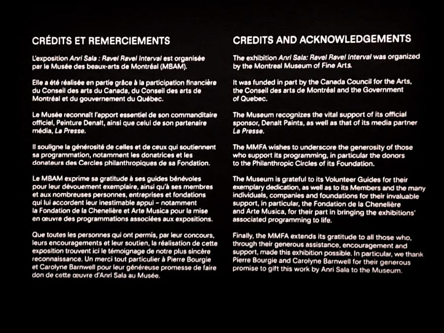

<em>Photo pris par Iryna Lysenko</em>

## Sources
*Source des informations: [Site web de MBAM](https://www.mbam.qc.ca/fr/expositions/anri-sala/)*
*Source de toutes les photos: Iryna Lysenko*
