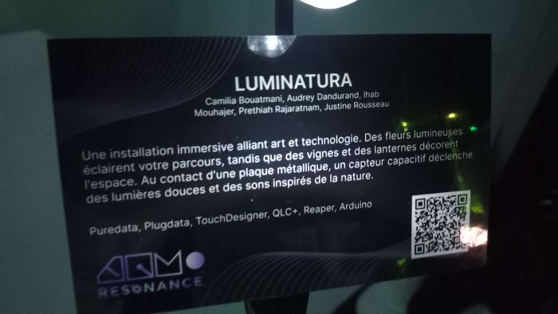

<h1 align="center">Luminatura - Mon oprojet préféré de Résonance</h1>

  

 

Le **18 mars dans le collège Montmorency (C1712),** mon classe de d’œuvres et de dispositifs multimédias et moi avons fait une visite dans **l'éxposition intéractive** intérieure temporaire (17-21 mars 2025) **Résonance**, qui démontre les **projets des finissants du programme de techniques d'intégration multimédia**. Principalement, cet exposition est orienté vers tous les étudiants de collège Montmorency, mais nous avons fait la visite pour voir ce que nous allons faire dans 2 ans dans notre programme.

  

## Luminatura

  

Luminatura est une installation interactive qui fusionne nature et technologie. En touchant une plaque métallique, le capteur capacitif détecte la conductivité de la peau des mains et en responce envoie des effets de lumière sur des fleurs lumineuses et des lanternes, aussi que des sons. En mettant en évidence notre capacité à transmettre l’énergie, elle symbolise notre pouvoir d’éclairer et de transformer le monde autour de nous, offrant une expérience immersive et poétique.  
Le projet a été en réalisation dès le 20 Janvier et finallement presenté le 21 mars 2025.

## Equipe

<table align="center">
<tr>
<td></td>
<td><b>Audrey Dandurand</b> 
Directrice audiovisuelle et gestionnaire</td>
<td></td>
<td><b>Justine Rousseau </b> 
Programmeuse et coordonnatrice des médias</td>
</tr>
<tr>
<td></td>
<td><b>Camilia Bouatmani </b> 
Directrice artistique</td>
<td></td>
<td><b>Prethiah Rajaratnam </b> 
Programmeuse et administratrice</td>
</tr>
<tr>
<td></td>
<td><b>Ihab Mouhajer</b>  
Développeur interactif</td>
</tr>
</table> 

## Expérience vécue
Mon experience: https://youtube.com/shorts/jXJaEOByhPg?feature=share 
https://youtube.com/shorts/hTXFvGfL0nw

## Sources
<a href="https://miaou-mafia.github.io/projet-luminatura/#/10_equipe/">Sourse des images - equipe de Lumunatura sur GitHub</a>
<a href="https://youtu.be/i6xJno_NFSc">Video des auteurs</a>
<a href="https://miaou-mafia.github.io/projet-luminatura/#/">GitHub des auteurs</a>
