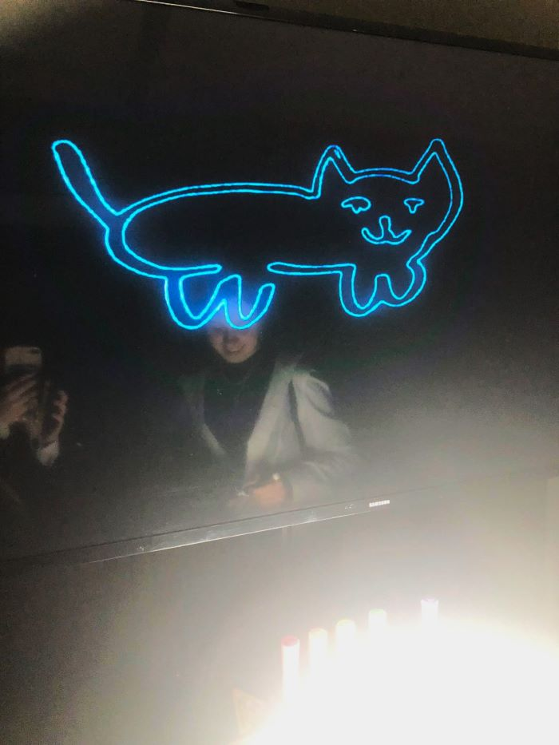
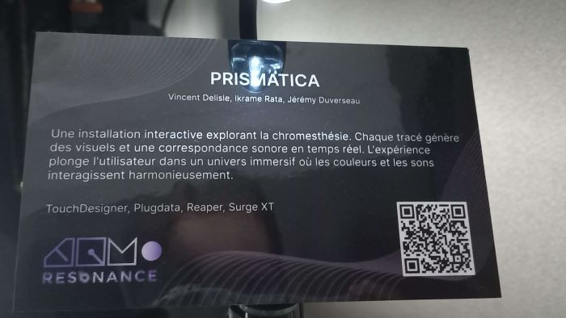
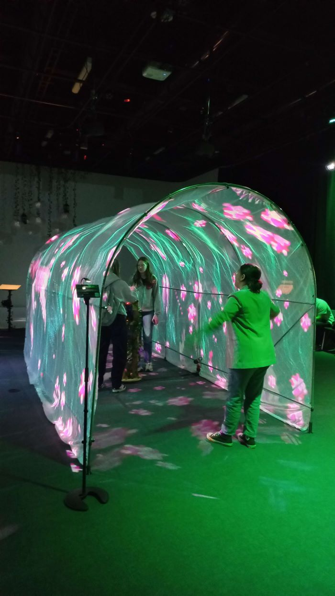
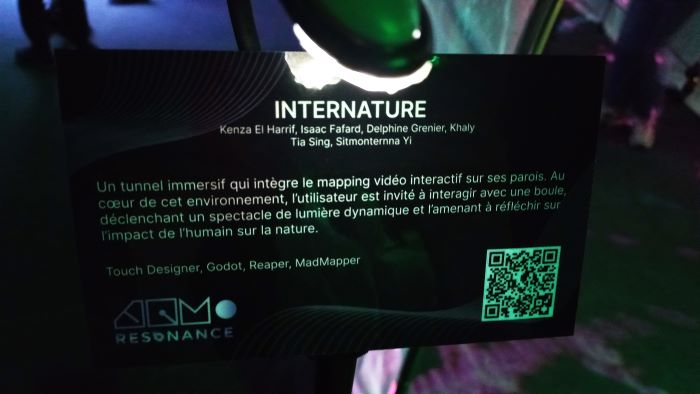
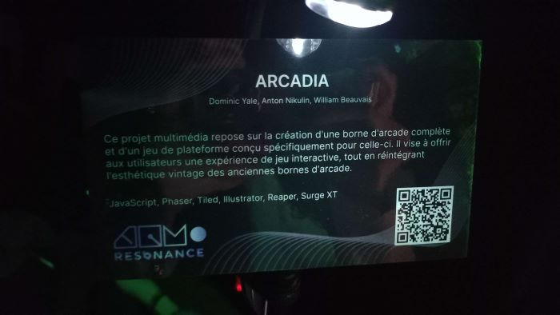

<h1 align="center">Resonance</h1>

  

  

Le **18 mars dans le collège Montmorency (local C1712),** ma classe d’œuvres et de dispositifs multimédias a visité dans **l'éxposition intéractive** intérieure temporaire (17-21 mars 2025) **Résonance**, qui présente  les **projets des finissants du programme de techniques d'intégration multimédia**. Principalement destinée à tous les étudiants du collège Montmorency, cette exposition nous a permis de découvrir ce que nous réaliserons dans deux ans dans notre programme.

# Prismatica

   

  

  

  

*Prismatica* est une installation interactive qui s’appuie sur la chromesthésie, une forme de synesthésie où les sons sont associés aux couleurs. L’utilisateur dessine sur un tableau blanc avec des marqueurs colorés, et une caméra reliée à TouchDesigner analyse les couleurs en temps réel. Chaque teinte génère une mélodie spécifique, en suivant le cercle chromatique de Newton. Cela crée une interaction où le dessin devient aussi une expérience sonore, fusionnant image et musique.

## Équipe
**Vincent Delisle**: Développeur et concepteur sonore  
**Ikrame Rata**: Chef de projet  
**Jérémy Duverseau**: Directeur Artistique

## Installation

   
  

## Sensation
Étant une personne artistique, j'ai eu envie de dessiner sur le tableu pour très longtemps car c'etait très facinant de voir ton dessin, mais en ecran et illuminé.
C'était amusant d'explorer les différents effets des différents marqueurs.

## Cours requis
Pour réaliser ce projet, il nous faut étudier les cours de: **Programmation interactive / Traitement audiovisuel / Audio**

## Technique utilisé

Ce qui m’a le plus intrigué, c'est la technique de capture vidéo de la planche à dessin, qui, grâce à une caméra, enregistre les dessins en temps réel, garantissant une synchronisation fluide et précise entre les éléments visuels et sonores.

## Sources
<a href="https://pootpookies.github.io/Prismatica/#/">Source des photos et des informations</a>

# Internature

   

  

  

  

*Internature* est un tunnel immersif où le mapping vidéo interactif recouvre les parois, accompagné d’une musique d’ambiance et de bruitages. L’utilisateur évolue dans un environnement de nature synthétique et peut interagir avec une boule pour modifier et enrichir l'environnement. Cette interaction déclenche un spectacle lumineux réactif au toucher, invitant à une réflexion sur l’impact de l’humain sur son environnement.

## Équipe
**Khaly Tia Sing**: Chargé de projet  
**Isaac Fafard**: Programmeur  
**Delphine Grenier**: conception visuel et programeuse  
**Sitmonternna Yi**: Mapping vidéo et conception sonore  
**Kenza El Harrif**: Directrice artistique

## Installation

  
  
   

## Sensation
Je me santais comme une déesse qui contrôle le monde autour d'elle.

## Technique utilisée

# Arcadia

   

  

  

  

ЗАМЕНИТЬ *Prismatica* est une installation interactive qui s’appuie sur la chromesthésie, une forme de synesthésie où les sons sont associés aux couleurs. L’utilisateur dessine sur un tableau blanc avec des marqueurs colorés, et une caméra reliée à TouchDesigner analyse les couleurs en temps réel. Chaque teinte génère une mélodie spécifique, en suivant le cercle chromatique de Newton. Cela crée une interaction où le dessin devient aussi une expérience sonore, fusionnant image et musique.

## Équipe
**Dominic Yale**: Conception sonore  
**William Beauvais**: Conception visuel  
**Anton Nukulin**: Programmation

## Installation

   
  

## Sensation
C'etait un bon experience de se sentir dans l'esthétique des années 80, en jouant à des jeux d'arcade. J'aime comment les auteurs ont bien recréé atmosphère retro avec les technologies modernes.

## Cours requis
Pour réaliser ce projet, il nous faut étudier les cours de: **Programmation interactive / Design Graphique / Audio**

## Technique utilisé

Ce qui m’a le plus intrigué, c'est comment ils ont reussi à changer des boutons "WASD" au commutateur pour déplacer de personage principal.

## Sources
 <a href="https://cousi-cousa.github.io/Arcadia/#/">Sources des photos et des informations</a>

# C0NDU8

   

  

  

  

ЗАМЕНИТЬ *Prismatica* est une installation interactive qui s’appuie sur la chromesthésie, une forme de synesthésie où les sons sont associés aux couleurs. L’utilisateur dessine sur un tableau blanc avec des marqueurs colorés, et une caméra reliée à TouchDesigner analyse les couleurs en temps réel. Chaque teinte génère une mélodie spécifique, en suivant le cercle chromatique de Newton. Cela crée une interaction où le dessin devient aussi une expérience sonore, fusionnant image et musique.

## Équipe
**Ian Corbin**: Mapping  
**Samuel Desmeules Voyer**: Directeur artistique  
**Alexandre Gervais**: Programmeur  
**Kevin Malric**: Responsable des médias  
**Jérémy Roy Côté**: Programmeur 

## Installation

   
  

## Sensation
C'etait un bon experience de se sentir dans l'esthétique des années 80, en jouant à des jeux d'arcade. J'aime comment les auteurs ont bien recréé atmosphère retro avec les technologies modernes.

## Cours requis
Pour réaliser ce projet, il nous faut étudier les cours de: **Programmation interactive / Design Graphique / Audio**

## Technique utilisé

Ce qui m’a le plus intrigué, c'est comment ils ont reussi à changer des boutons "WASD" au commutateur pour déplacer de personage principal.

## Sources
 <a href="https://cousi-cousa.github.io/Arcadia/#/">Sources des photos et des informations</a>

# Fuga

# Etheria
