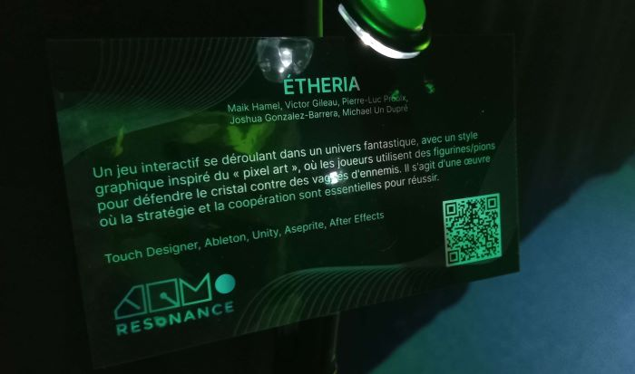

<h1 align="center">Resonance</h1>

  

  

Le **18 mars dans le collège Montmorency (local C1712),** ma classe d’œuvres et de dispositifs multimédias a visité dans **l'exposition intéractive** intérieure temporaire (17-21 mars 2025) **Résonance**, qui présente  les **projets des finissants du programme de techniques d'intégration multimédia**. Destinée principalement à tous les étudiants du collège Montmorency, cette exposition nous a permis de découvrir ce que nous réaliserons dans deux ans dans notre programme.

<h1 align="center"> Prismatica</h1> 

   

  

  

  

*Prismatica* est une installation interactive qui s’appuie sur la chromesthésie, une forme de synesthésie où les sons sont associés aux couleurs. L’utilisateur dessine sur un tableau blanc avec des marqueurs colorés, et une caméra reliée à TouchDesigner analyse les couleurs en temps réel. Chaque teinte génère une mélodie spécifique, en suivant le cercle chromatique de Newton. Cela crée une interaction où le dessin devient aussi une expérience sonore, fusionnant image et musique.

## Équipe
**Vincent Delisle**: Développeur et concepteur sonore  
**Ikrame Rata**: Chef de projet  
**Jérémy Duverseau**: Directeur Artistique

## Installation

   
  

## Sensation
Étant une personne artistique, j'ai eu envie de dessiner sur le tableau pour très longtemps car c'etait très fascinant de voir ton dessin, mais à l’écran et illuminé.
C'était amusant d'explorer les différents effets des différents marqueurs.

## Cours requis
Pour réaliser ce projet, il nous faut étudier les cours de: **Programmation interactive / Traitement audiovisuel / Audio**

## Technique utilisée

Ce qui m’a le plus intrigué, c'est la technique de capture vidéo de la planche à dessin, qui, grâce à une caméra, enregistre les dessins en temps réel, garantissant une synchronisation fluide et précise entre les éléments visuels et sonores.

## Sources
<a href="https://pootpookies.github.io/Prismatica/#/">Source des photos et des informations</a>

<h1 align="center">Internature</h1> 

   

  

  

  

*Internature* est un tunnel immersif où le mapping vidéo interactif recouvre les parois, accompagné d’une musique d’ambiance et de bruitages. L’utilisateur évolue dans un environnement de nature synthétique et peut interagir avec une boule pour modifier et enrichir l'environnement. Cette interaction déclenche un spectacle lumineux réactif au toucher, invitant à une réflexion sur l’impact de l’humain sur son environnement.

## Équipe
**Khaly Tia Sing**: Chargé de projet  
**Isaac Fafard**: Programmeur  
**Delphine Grenier**: conception visuel et programeuse  
**Sitmonternna Yi**: Mapping vidéo et conception sonore  
**Kenza El Harrif**: Directrice artistique

## Installation

  
  
   

## Sensation
Je me santais comme une déesse qui contrôle le monde autour d'elle. C'était fascinant de se plonger dans ce tunnel immersif de la nature. Cependant, parfois, j'ai eu l'impression que quand je tourne la balle, rien ne changait ou ne fonctionnait pas comme prévu, par contre ce n'a pas abîmé l'experience.

## Cours requis
Pour réaliser ce projet, il nous faut étudier les cours de: **Programmation interactive / Web 4 / Audio 2 / Traitement audiovisuel / Objets Interactif**

## Technique utilisée
J'ai eu beaucoup de questions de fonctionnement pour l'équipe, car nous n'avons pas étudié la plupart des logiciels, des cours et des téchniques. Par exemple, la façon dont les étudiants ont dû ajuster avec précision les projections sur des surfaces arrondies en utilisant des logiciels de mapping. Je pensais, à tort, qu’un projecteur suffisait et que l’image se plaçait correctement sans correction.

## Sources
<a href="https://tprangers.github.io/internature/#/">Source des photos et des informations</a>

<h1 align="center">Arcadia</h1> 

   

  

  

  

*Arcadia* est un projet interactif qui plonge les participants dans l’ambiance des salles d’arcade d’autrefois. Son but est de recréer cette expérience nostalgique à travers un jeu inspiré des classiques du genre. Du design de la borne aux graphismes en pixel art, tout a été pensé pour offrir une immersion rétro authentique.

## Équipe
**Dominic Yale**: Conception sonore  
**William Beauvais**: Conception visuel  
**Anton Nukulin**: Programmation

## Installation

   
  

## Sensation
C'etait un bon experience de plonger dans l’esthétique des années 80, en jouant à des jeux d'arcade. J'aime comment les auteurs ont bien recréé atmosphère rétro avec les technologies modernes.

## Cours requis
Pour réaliser ce projet, il nous faut étudier les cours de: **Web (3-5) / Installation multimédia / Audio 2**

## Technique utilisée

Ce qui m’a le plus intrigué, c'est comment ils ont réussi à remplacer les boutons WASD par un commutateur pour déplacer de personage principal.

## Sources
 <a href="https://cousi-cousa.github.io/Arcadia/#/">Sources des photos et des informations</a>
 <a href="https://tim-montmorency.com/2025/#/">Résonance</a>

<h1 align="center">C0NDU8</h1> 

   

  

  

  

*C0N DU8* (prononcé "Conduite") est un jeu d’arcade extraordinaire où le joueur (l'utilisateur) incarne l’esprit d’un motard décédé, naviguant à vélo à travers un purgatoire virtuel. La vitesse et la direction se contrôlent en pédalant sur un vélo stationnaire, rendant l’expérience immersive et physique.

## Équipe
**Ian Corbin**: Mapping  
**Samuel Desmeules Voyer**: Directeur artistique  
**Alexandre Gervais**: Programmeur  
**Kevin Malric**: Responsable des médias  
**Jérémy Roy Côté**: Programmeur 

## Installation

  
   

## Sensation
J'aime la façon dont l'équipe a réussi à combiner le sport et l'immersion. C'est une bonne idée pour motiver les gens de faire plus de sport, car c'est plus divertissant. Cependant, le vélo lui-même nécessite un peu de travail, car pour le conduire, il faut pédaler trop vite (plus vite qu'en réalité).

## Cours requis
Pour réaliser ce projet, il nous faut étudier les cours de: **Interactivité ludique / Objets interactifs / Réalité mixte**

## Technique utilisée
Ce qui m’a le plus intrigué, comment, en bougeant ton corps, tu contrôles tu contrôles les déplacements du personnage à l’écran? Des capteurs détectent tes mouvements et transmettent les données à l’ordinateur, rendant l’expérience interactive.

## Sources
 <a href="https://gearshift-games.github.io/Web-C0N-DU8/#/">Sources des photos et des informations</a>

<h1 align="center">Fuga</h1>  

   

  

  

  

*Fuga* est une installation interactive permettant de générer un modèle d’arbre 3D personnalisé. Ce projet explore comment la technologie, lorsqu’elle est utilisée de manière réfléchie, peut accompagner et renforcer la nature. L’utilisateur manipule un générateur de signaux conçu sur mesure pour produire des sons influençant la croissance de l’arbre virtuel. En expérimentant avec les fréquences et en ajustant les paramètres, il cherche l’équilibre idéal, créant ainsi un environnement visuel et sonore à la fois harmonieux et unique.

## Équipe
**Matis Labelle**: Chargé de projet  
**Tristan Kkadka**: Directeur sonore  
**Daniel Dezemma**: Directeur Visuel  
**Abdel Ali Djeral**: Programmeur  
**Yavuz-Selim Gucluer**: Programmeur

## Installation

  
   

## Sensation
Je trouve que l'idée d'un arbre interactif réagissant au son est originale. Voir son évolution selon mes actions est fascinant. La fusion nature-technologie et la personnalisation sonore enrichissent l’expérience, d’autant plus qu’elle est accessible à plusieurs.

## Cours requis
Pour réaliser ce projet, il nous faut étudier les cours de: **Audio 2 / Web (4-5) / Réalitée mixte**

## Technique utilisée
Ce qui m’a le plus intrigué, c'est comment on change les différents aspects des arbres sur les écrans différents, mais au même temps on voit les autres aspets aussi.

## Sources
 <a href="https://escapism-fuga.github.io/Fuga/#/">Sources des photos et des informations</a>

<h1 align="center">Etheria</h1>  

   

  

  

  

*Étheria* est un jeu interactif en pixel art où les joueurs contrôlent des pions pour défendre une pierre contre des vagues d’ennemis. Structuré en plusieurs manches, il propose une montée progressive en difficulté et permet d’obtenir des "power-ups" au fil de la partie. L’univers s’inscrit dans un cadre fantastique, avec une direction artistique inspirée du pixel art et une ambiance sonore en 8 bits qui enrichit l’expérience de jeu.

## Équipe
**Joshua Gonzalez Barrera*: Monteur vidéo  
**Victor Gileau**: Programmeur  
**Michel Un Dupré**: Programmeur, Artiste   
**Pierre-Luc Proux**: Programmeur, Artiste  
**Maik Hamel**: Composition sonore

## Installation

  
   

## Sensation
J'aime l'aspect travail d'équipe nécessaire pour réussir la quête. Ce projet est vraiment original, mais requiert beaucoup d'efforts pour être testé. 

## Cours requis
Pour réaliser ce projet, il nous faut étudier les cours de: **Interactivité ludique / Instalation multimédia / Objet Interactifs**

## Technique utilisée
Les capteurs détectent avec précision la position des jetons que les joueurs manipulent tiennent pour jouer, ce que je trouve fascinant. Ils transmettent ces données à l’ordinateur, rendant ainsi l’interaction fluide et immersive.

## Sources
 <a href="https://ethereal-creators.github.io/Etheria/#/">Sources des photos et des informations</a>
