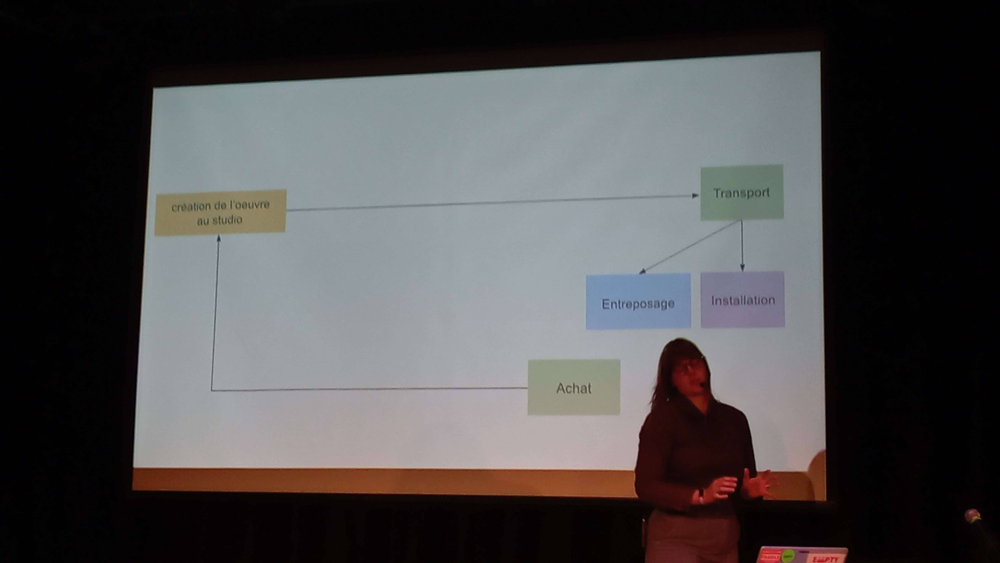
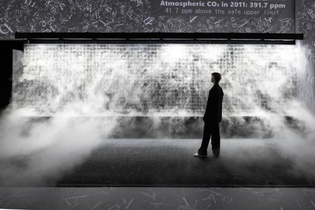

# Production des projets interactifs de Rafael Lozano-Hemmer

Le **25 mars 2025 de *12h30 à 14h00*, au Collège Montmorency, dans la salle Claude-Legault (B1346),** ma classe d’œuvres et de dispositifs multimédias a assisté à **une conférence donnée par Jade Séguéla**, qui nous a présenté **le studio de Rafael Lozano-Hemmer — *artiste multimédia canadien***. Dans ce studio, basé à Montréal, lui et son équipe conçoivent des œuvres interactives diffusées à l’international. Destinée principalement aux étudiants du Collège Montmorency, cette conférence nous a permis de découvrir les types de projets que nous pourrions réaliser après notre programme. Madame Séguéla nous a présenté plusieurs œuvres créées par le studio, tout en expliquant leur processus de production.

## Contenu

Premièrement, Jade Séguéla nous a expliqué en détail comment leur équipe répartit les tâches au sein des projets, à savoir :  
- **Recherche** (technicien.ne.s mécaniques, programmeur.se.s créatif.ve.s, technicien.ne.s),  
- **Production** (technicien.ne.s, coordonnateur.rice.s),  
- **Conservation** (spécialistes en technologies, programmeur.se.s),  
- **Exposition** (responsables de la communication, artistes 3D, monteurs vidéo, assistant.e.s aux expositions).  

Elle a ensuite précisé que leur équipe catégorise les projets selon leur niveau d’interactivité :  
- **Passive**, comme marcher, regarder ou respirer,  
- **Active**, comme parler ou appuyer sur un bouton.  

Cependant, un point commun demeure essentiel pour tous les projets : ils doivent susciter des émotions chez l’utilisateur.trice, car c’est ce que Rafael Lozano-Hemmer valorise le plus. Elle a également partagé des dessins préparatoires réalisés par elle-même pour l’un des projets, où chaque vis était précisément indiquée.

<a href="https://www.lozano-hemmer.com/showimage_emb.php?proj=cloud_display&img=sydney_2023&idproj=348&type=artwork&id=7">Source d'image : Marinco Kojdanovski sur site web de l’atelier Lozano-Hemmer</a>

Deuxièmement, madame Séguéla nous a présenté plusieurs œuvres du studio, telles que *Binocular Tension*, *Shadow Tuner*, *Sphere Packing: Bach* et mon projet préféré — *Cloud Display*.
